  <picture>
    <!-- If you saved both SVGs, rename them to dark.svg and light.svg -->
    <!-- <source media="(prefers-color-scheme: dark)" srcset="./dark.svg"> -->
    <!-- <source media="(prefers-color-scheme: light)" srcset="./light.svg"> -->
    
  </picture>

 

## 👨‍💻 About Me

I am a Software Engineer and Computer Science undergraduate (2nd-year) at **IIIT Kottayam**, specializing in high-performance backend systems, custom language transpilers, and local AI tooling. I focus on building robust, scalable architecture rather than just pasting together APIs.

**🟢 Availability:** I am currently open to **remote internships and flexible asynchronous engineering roles** that can accommodate my university schedule.

---

## 🚀 Featured Engineering & Architecture

### ⚙️ [EmojiScript](https://github.com/krauzX/emoji-script)
> **Custom AST Transpiler & Language Engine**
> Engineered a custom transpiler and multi-mode parser that compiles abstract emoji-based syntax directly into executable JavaScript.
> *Stack: TypeScript, Node.js, Compiler Design*

### 🧠 [Cognitive Debugger](https://github.com/krauzX/cognitive-debugger)
> **Automated Logic Parsing Pipeline**
> Built a production-ready CLI tool and REST API that parses, evaluates, and tracks logic errors using a custom rule engine.
> *Stack: Python, SQLite, REST Architecture*

### 🌍 [EcoShare](https://github.com/krauzX/ecoshare)
> **Peer-to-Peer Resource Network**
> Architected the backend and database schemas for a high-throughput resource-sharing web application.
> *Stack: Next.js, Supabase, PostgreSQL*

### ⚡ [Gitright](https://github.com/krauzX/gitright)
> **System-Level Developer Tooling**
> High-speed Git workflow automation CLI built to streamline repository management and monorepo architectures.
> *Stack: Go (Golang), CLI Tooling*

---

## 🛠️ Core Stack

**Languages:** Go, Rust, TypeScript, JavaScript, Python  
**Databases & Tools:** PostgreSQL, SQLite, Docker, Supabase, Git  
**Frameworks & Engines:** Node.js, Next.js, Svelte, Godot 4.7 (2D/3D), Streamlit  

---

## 📊 Analytics & Impact

  
  

 

  

---

  

