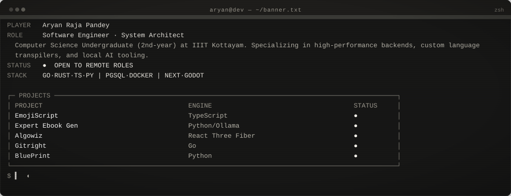
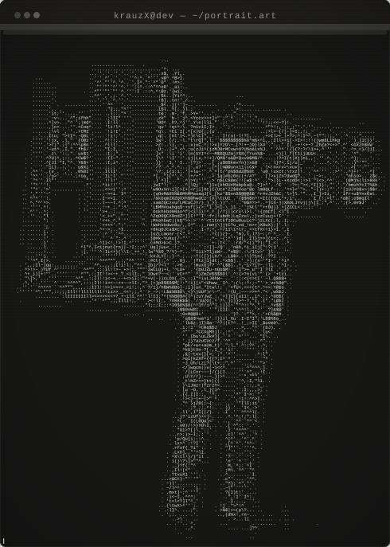
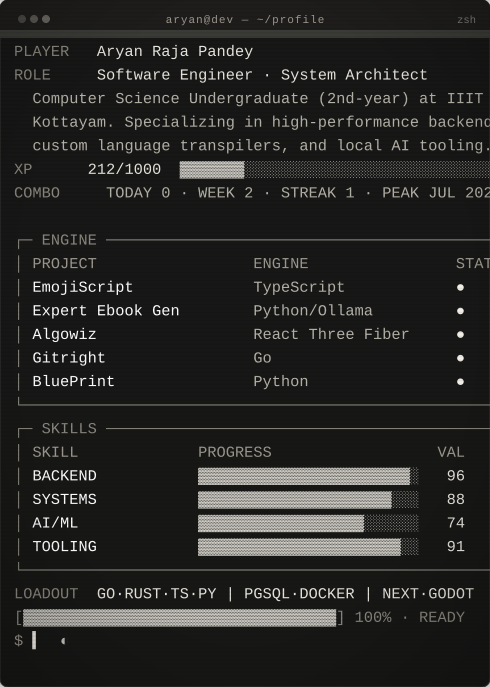
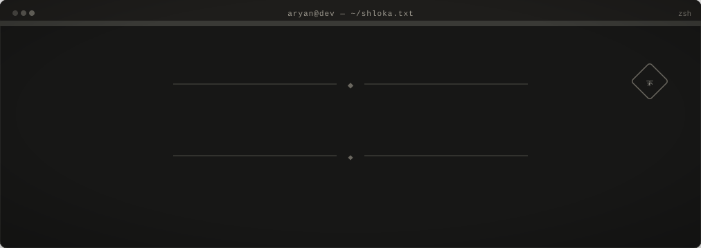
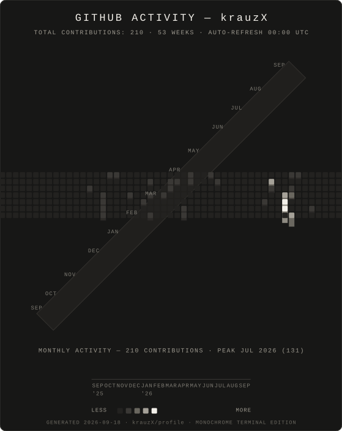

  

## about

I'm **Aryan Raja Pandey** — a software engineer and systems architect, and a 2nd-year computer science undergraduate at IIIT Kottayam. I build the software that runs *under* other software: compilers and transpilers, language engines, and developer tooling that makes everything else faster.

Three things drive most of what I make: **high-performance backends** that stay fast under load, **custom language tooling** that turns ideas into executable code, and **local-first AI** that runs on your own hardware instead of someone else's cloud. I care about software that stays fast when nobody is watching — and I believe effort ships what wishes only describe.

- github — [github.com/krauzX](https://github.com/krauzX)
- open to remote roles

## stack

| area | technologies |
|---|---|
| languages | Go · Rust · TypeScript · Python |
| data & infrastructure | PostgreSQL · Docker |
| frontend & tools | Next.js · Godot |
| focus | high-performance backends · custom language transpilers · local AI tooling |

## what I'm building

| project | what it does | stack |
|---|---|---|
| **EmojiScript** | a custom AST transpiler and language engine that compiles emoji-based syntax into executable JavaScript | TypeScript |
| **Expert Ebook Gen** | a LangGraph multi-agent system that orchestrates long-form manuscript generation, with local Ollama model fallbacks | Python · Ollama · LangGraph |
| **Algowiz** | a 3D algorithm visualization engine for complex data structures and graph states | React Three Fiber |
| **Gitright** | system-level developer tooling for everyday workflows | Go |
| **BluePrint** | an AI water-and-carbon footprint tracker, shipped in 48 hours | Python · Streamlit |

## how I work

- **The terminal is home.** Plain text, monospace, keyboard-first — if it can't run in a terminal, it isn't finished.
- **Local-first intelligence.** Models and tooling that run on your own hardware. Private by default, fast by design.
- **Build tools, not demos.** Demos impress once; tools compound. A small, sharp tool used every day beats a big one used never.
- **Monochrome discipline.** One palette, one typeface, no noise. Constraints breed clarity — in code and in design.

## profile

<table border="0" cellpadding="0" cellspacing="0" align="center" style="table-layout:fixed;max-width:1012px;width:100%">
  <tr>
    <td width="50%" align="center" valign="middle" style="padding:0 8px 0 0">
      
    </td>
    <td width="50%" align="center" valign="middle" style="padding:0 0 0 8px">
      
    </td>
  </tr>
</table>

## shloka

  

> *उद्यमेन हि सिध्यन्ति कार्याणि न मनोरथैः* — **by effort, not by wishes, are deeds accomplished.** Chanakya Niti, in ink. It is the "how I work" above, in one line.

## activity

  

264 contributions across 53 weeks — peak month at 164 — refreshed nightly.

---

crafted locally · refreshed nightly · monochrome by choice

